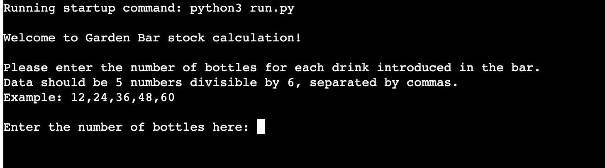
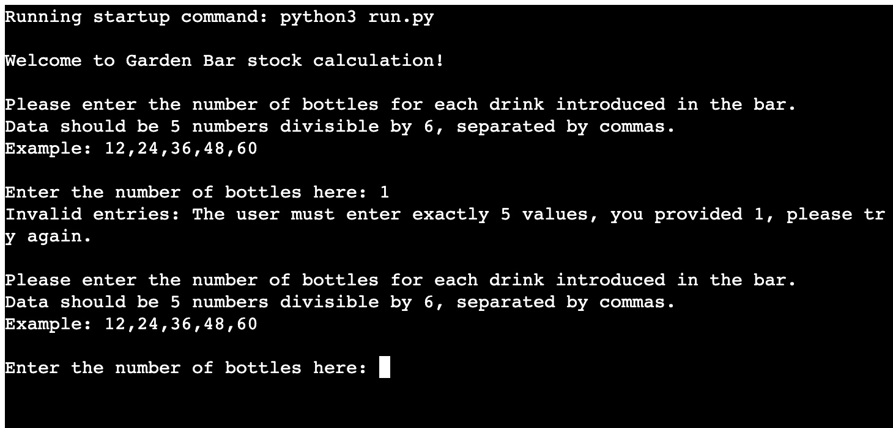
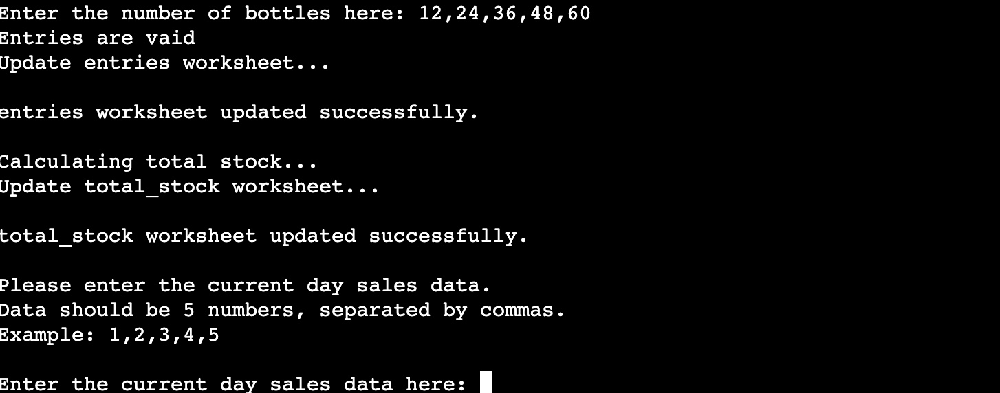
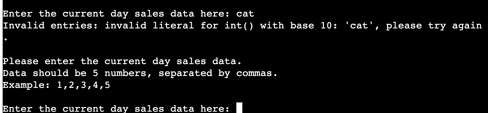
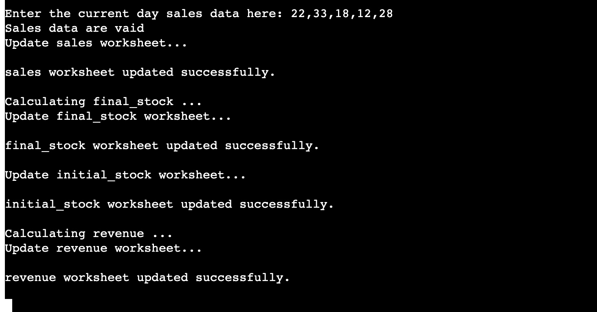

# Garden Bar Stock
## Project Portofolio Three
At the Garden Bar the stock was made using the classic pen and paper tool. The bar's popularity increased so it became very buisy. The stuff couldn't handle making the stock anymore and so this command-line aplication was created for helping staff to save time and to be more precise with the bar's inventory.

The live project can be viewed here - [Garden Bar Stock](https://garden-bar-stock.herokuapp.com/)

The GitHub repository can be viewed here - [FlorinDorneanu/garden-bar-stock](https://github.com/FlorinDorneanu/garden-bar-stock)
***

## User Experience (UX)

### Strategy
* The application will provide a easier way to calculate the stock and revenue data.
* When created the application the initial stock will be already stored in google spreadsheet.
* The application will request the user to input entries data.
* Adding initial stock to entries data, the total stock will be calculated.
* The application will request the user to input sales data.
* Substract sales from total stock data, the final stock will be calculated.
* The data from final stock will be imported to initial stock data so it can be used for the next day calculation.
* The prices for each drink will be provided in the spreadsheet.
* Multiplying sales with drinks prices the revenue for the day will be calculated.
***

### User Stories
As an employee I expect to:
* Easily access the application.
* Enter the data without any difficulties.
* Be informed if my data is not valid.
* To re-enter data until is provided correctly without having to restart the application.
* Retrieve data from google spreadsheet.
* Be abble to calculate the total and final stock with ease.
* Access the drinks prices from google spreadsheet in case of a possible price change.
* Be able to calculate the daily revenue.

As the employer I expect to:
* Be able to access all the data that my employes enter.
* Have all the data stored for monthly income calculation.
* To be easily informed about the daily revenue.
***

### Structure
* The user is beeing welcomed to the Garden Bar Stock calculation.
* The aplication request the user to enter the number of bottles per each drink that was introduced in the bar.
* The user is beeing informed on how to enter a valid input.
* The aplication request data from user until the data is valid.
* The user is beeing informed that the data is valid.
* The user is beeing informed that the entries worksheet has been succesfully updated.
* The user is beeing informed that the total stock worksheet has been successfully updated.
* The aplication request the user to enter the current day sales data.
* The user is beeing informed about how to enter a valid input.
* The aplication request data from user until the data is valid.
* The user is beeing informed that the data is valid.
* The user is beeing informed that the sales worksheet has been succesfully updated.
* The user is beeing informed that the final stock worksheet has been successfully updated.
* The user is beeing informed that the initial stock has been updated with the final stock for the current day.
* The user is beeing informed that the revenue is being calculated.
* The user is beeing informed that the revenue worksheet has been succesfully updated.
***

### Sceleton
* The aplication consists of a simple interface that requests only two inputs from the user to calcuate the daily stock and revenue for the bar.

If the user enters an invaid input data, an error will apear informing the user about the mistake that was made and will continue requesting the user to input data until the data is valid.
***

## Features
### Existing Features
* The user is being welcome to Garden Bar Stock calculation.
* The application requests the user to enter the number of bottles for each drink introduced in the bar and informs the user on how to enter a valid data.

* The user has to enter five digits numbers that are dibisible by 6, separated by commas.
* The application provide an exaple of valid data.
* If the user's input data is invalid then an error message will appear.

* The aplication request the user to re-enter data until the data is valid.

* The user is beeing informed:
  * That the entries are valid.
  * The entries are going to be updated to worksheet.
  * The entries worksheet is successfully updated to worksheet.
  * The total stock is calculated.
  * The total stock is going to be updated to worksheet.
  * The total stock is successfully updated to worksheet.
* The aplication request the user to introduce the current day sales data.
* The input has to be 5 digit numbers separated by commas.
* The application provide an exaple of valid data.

* If the user's input data is invalid then an error message will appear.
* The aplication request the user to re-enter data until the data is valid.

* The user is beeing informed:
  * That the sales are valid.
  * The sales are going to be updated to worksheet.
  * The sales worksheet is successfully updated to worksheet.
  * The final stock is calculated.
  * The final stock is going to be updated to worksheet.
  * The final stock is successfully updated to worksheet.
  * The initial stock is goinng to be updated to worksheet with the final stock data.
  * The revenue is going to be calculated.
  * The revenue is going to be updated to worksheet.
  * The revenue is successfully updated to worksheet.

  
  

  
  
